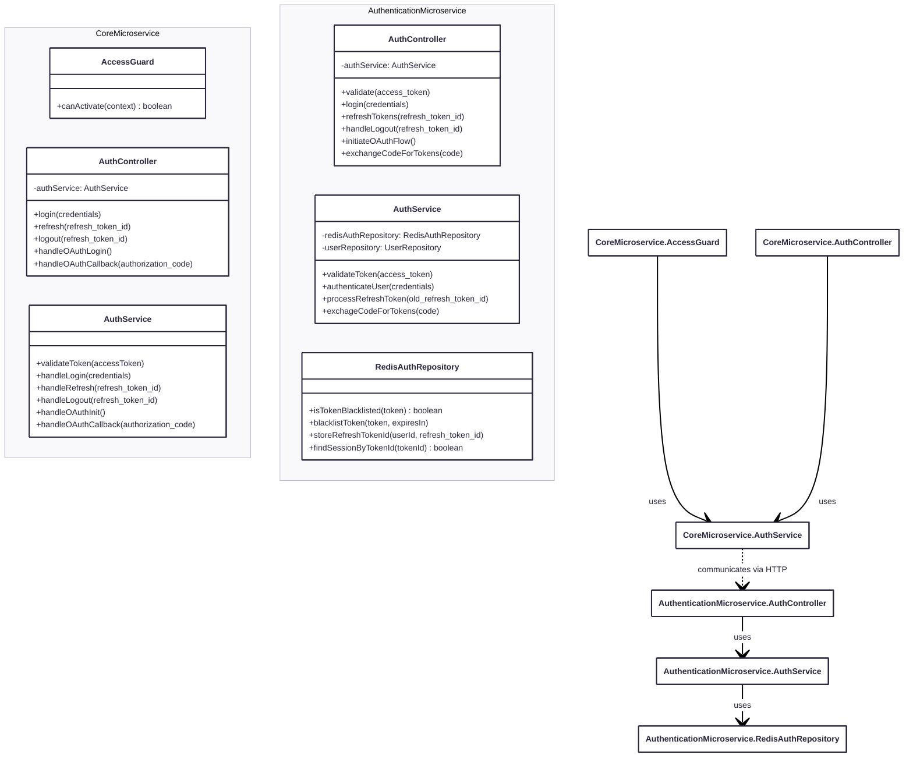

# Classes diagrams

## Authentication Classes: Core Microservice ↔ Auth. Microservice (CLASS DIAGRAM)

```mermaid
---
config:
  class:
    hideEmptyMembersBox: true
  theme: redux
---
classDiagram
direction TB
 namespace CoreMicroservice {
        class AccessGuard {
         +canActivate(context) boolean
        }
        class CoreAuthController["AuthController"] {
         -authService: AuthService
         +login(credentials)
         +refresh(refresh_token_id)
         +logout(refresh_token_id)
            +handleOAuthLogin()
            +handleOAuthCallback(authorization_code)
        }
        class CoreAuthService["AuthService"] {
         +validateToken(accessToken)
         +handleLogin(credentials)
         +handleRefresh(refresh_token_id)
         +handleLogout(refresh_token_id)
            +handleOAuthInit()
            +handleOAuthCallback(authorization_code)
        }
 }
 namespace AuthenticationMicroservice {
        class AuthMSAuthController["AuthController"] {
         -authService: AuthService
         +validate(access_token)
         +login(credentials)
         +refreshTokens(refresh_token_id)
         +handleLogout(refresh_token_id)
            +initiateOAuthFlow()
            +exchangeCodeForTokens(code)
        }
        class AuthMSAuthService["AuthService"] {
         -redisAuthRepository: RedisAuthRepository
            -userRepository: UserRepository
         +validateToken(access_token)
         +authenticateUser(credentials)
         +processRefreshToken(old_refresh_token_id)
            +exchageCodeForTokens(code)
        }
        class RedisAuthRepository {
         +isTokenBlacklisted(token) boolean
         +blacklistToken(token, expiresIn)
            +storeRefreshTokenId(userId, refresh_token_id)
            +findSessionByTokenId(tokenId) boolean
        }
 }

    CoreMicroservice.AccessGuard --> CoreMicroservice.AuthService : uses
    CoreMicroservice.AuthController --> CoreMicroservice.AuthService : uses
    CoreMicroservice.AuthService ..> AuthenticationMicroservice.AuthController : communicates via HTTP
    AuthenticationMicroservice.AuthController --> AuthenticationMicroservice.AuthService : uses
    AuthenticationMicroservice.AuthService --> AuthenticationMicroservice.RedisAuthRepository : uses
```
