# Client Application Structure (BASE IMPLEMENTATION) (FLOWCHART)

## Detailed Routing Structure

### Authentication Routes (`/auth`)

- `/auth/signup` - User registration (email/password + OAuth)
- `/auth/signin` - User login

### Main App Routes (`/app`)

#### Dashboard (`/app/feed`)

- Main page with posts feed
- Navigation to main sections

#### Profile Routes (`/app/profile`)

- `/app/profile/me` - My profile
- `/app/profile/[username]` - Other user's profile
- `/app/profile/me/edit` - Edit profile
- `/app/profile/me/followers` - My followers
- `/app/profile/me/following` - My following
- `/app/profile/me/follow-requests` - Follow requests

#### Posts Routes (`/app/posts`)

- `/app/posts/create` - Create post
- `/app/posts/[id]` - View post
- `/app/posts/[id]/edit` - Edit post
- `/app/posts/archived` - Archived posts

#### Feed Routes (`/app/feed`)

- `/app/feed` - Main feed

#### Chat Routes (`/app/chat`)

- `/app/chat` - Chat list
- `/app/chat/[id]` - Chat room
- `/app/chat/create` - Create chat
- `/app/chat/group/[id]/settings` - Group chat settings

#### Settings Routes (`/app/settings`)

- `/app/settings/account` - Account settings
- `/app/settings/privacy` - Privacy settings
- `/app/settings/notifications` - Notification settings
- `/app/settings/delete-account` - Delete account

## Schema

```mermaid
graph TD
    A[App Root /] --> B[Authentication]
    A --> C[Main App /app]

    subgraph "Authentication Pages"
        B1["/auth/signup"]
        B2["/auth/signin"]
    end

    subgraph "Dashboard"
        D1[Main Feed]
        D2[My Posts]
        D3[Liked Posts]
        D4[Commented Posts]
    end

    subgraph "Profile Pages"
        E1["/app/profile/me<br/>My Profile"]
        E2["/app/profile/[username]<br/>Other Profile"]
        E3["/app/profile/me/edit<br/>Edit Profile"]
        E4["/app/profile/me/followers<br/>My Followers"]
        E5["/app/profile/me/following<br/>My Following"]
        E6["/app/profile/me/follow-requests<br/>Follow Requests"]
    end

    subgraph "Posts Pages"
        F1["/app/posts/create<br/>Create Post"]
        F2["/app/posts/[id]<br/>View Post"]
        F3["/app/posts/[id]/edit<br/>Edit Post"]
        F4["/app/posts/archived<br/>Archived Posts"]
    end

    subgraph "Feed Pages"
        G1["/app/feed<br/>Main Feed"]
    end

    subgraph "Chat Pages"
        H1["/app/chat<br/>Chat List"]
        H2["/app/chat/[id]<br/>Chat Room"]
        H3["/app/chat/create<br/>Create Chat"]
        H4["/app/chat/group/[id]/settings<br/>Group Settings"]
    end

    subgraph "Settings Pages"
        I1["/app/settings/account<br/>Account Settings"]
        I2["/app/settings/privacy<br/>Privacy Settings"]
        I3["/app/settings/notifications<br/>Notification Settings"]
        I4["/app/settings/delete-account<br/>Delete Account"]
    end

    B --> B1
    B --> B2

    C --> D[Dashboard /app/dashboard]
    C --> E[Profile /app/profile]
    C --> F[Posts /app/posts]
    C --> G[Feed /app/feed]
    C --> H[Chat /app/chat]
    C --> I[Settings /app/settings]

    D --> D1
    D --> D2
    D --> D3
    D --> D4

    E --> E1
    E --> E2
    E --> E3
    E --> E4
    E --> E5
    E --> E6

    F --> F1
    F --> F2
    F --> F3
    F --> F4

    G --> G1

    H --> H1
    H --> H2
    H --> H3
    H --> H4

    I --> I1
    I --> I2
    I --> I3
    I --> I4
```

