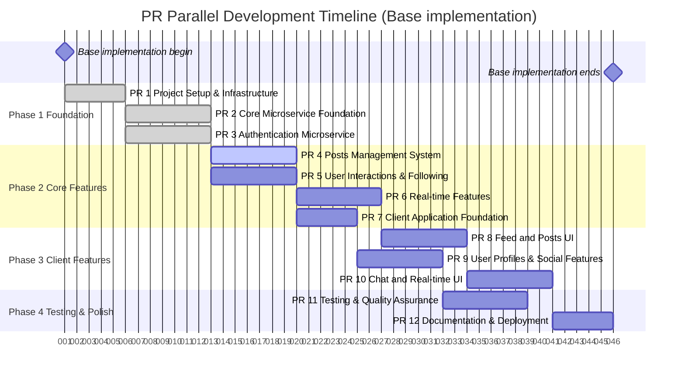

# PRs Plan Gantt Chart

```mermaid
---
config:
  theme: default
---
gantt
    title PR Parallel Development Timeline (Base implementation)
    dateFormat  DD.MM.YYYY
    axisFormat  %j
    tickInterval 1day
    weekday monday

    Base implementation begin: milestone, pr1,  0000-01-01, 1m
    Base implementation ends: milestone, pr1,  0000-02-15, 1m

    section Phase 1 Foundation
    PR 1 Project Setup & Infrastructure   :done, pr1, 0000-01-01, 5d
    PR 2 Core Microservice Foundation    :done, pr2, after pr1, 7d
    PR 3 Authentication Microservice     :done, pr3, after pr1, 7d
    section Phase 2 Core Features
    PR 4 Posts Management System         :active, pr4, after pr2, 7d
    PR 5 User Interactions & Following    :pr5, after pr3, 7d
    PR 6 Real-time Features               :pr6, after pr4, 7d
    PR 7 Client Application Foundation    :pr7, after pr5, 5d
    section Phase 3 Client Features
    PR 8 Feed and Posts UI                :pr8, after pr6, 7d
    PR 9 User Profiles & Social Features  :pr9, after pr7, 7d
    PR 10 Chat and Real-time UI           :pr10, after pr8, 7d
    section Phase 4 Testing & Polish
    PR 11 Testing & Quality Assurance     :pr11, after pr9, 7d
    PR 12 Documentation & Deployment      :pr12, after pr10, 5d
```
