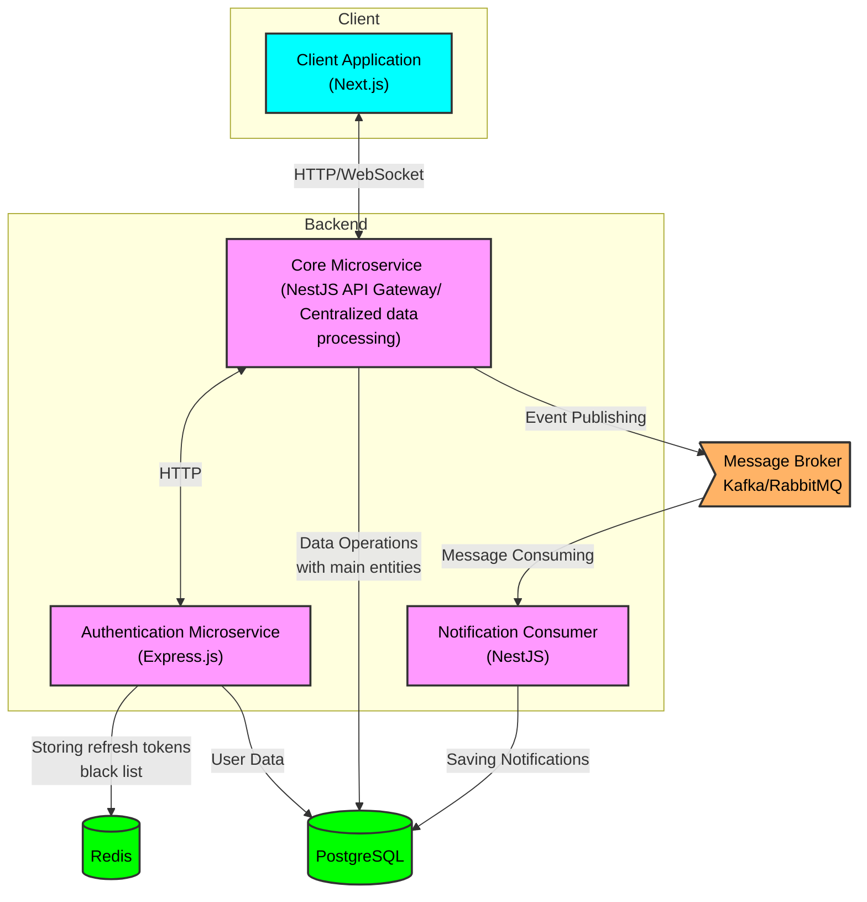

# Project Architecture Schema (FLOWCHART)

```mermaid
---
config:
  layout: dagre
---
flowchart TD
 subgraph Client["Client"]
        A["Client Application <br> (Next.js)"]
  end
 subgraph Backend["Backend"]
        B["Core Microservice <br> (NestJS API Gateway/<br> Centralized data processing)"]
        C["Authentication Microservice <br> (Express.js)"]
        D["Notification Consumer <br> (NestJS)"]
  end

  G>"Message Broker <br> Kafka/RabbitMQ"]
    A <-- HTTP/WebSocket --> B
    B <-- HTTP --> C
    B -- Data Operations<br>with main entities --> E[("PostgreSQL")]
    B -- Event Publishing -->G
    C -- Storing refresh tokens <br> black list --> F[("Redis")]
    C -- User Data --> E
    G -- Message Consuming --> D
    D -- Saving Notifications --> E

    style A fill:cyan,stroke:#333,stroke-width:2px,color:black
    style B fill:#f9f,stroke:#333,stroke-width:2px,color:black
    style C fill:#f9f,stroke:#333,stroke-width:2px,color:black
    style D fill:#f9f,stroke:#333,stroke-width:2px,color:black
    style E fill:lime,stroke:#333,stroke-width:2px,color:black
    style G fill:#ffb366,stroke:#333,stroke-width:2px,color:black
    style F fill:lime,stroke:#333,stroke-width:2px,color:black
```
