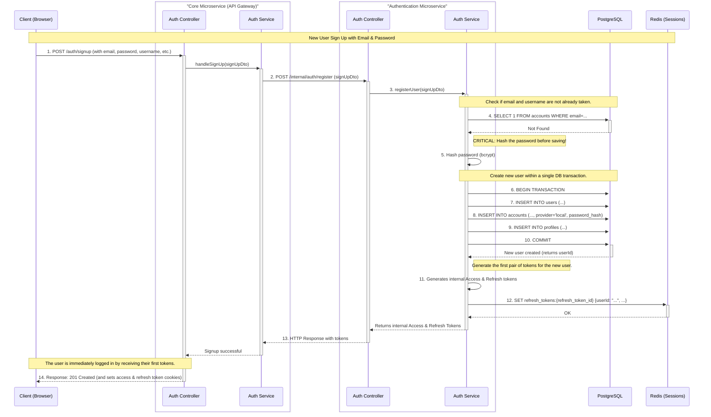
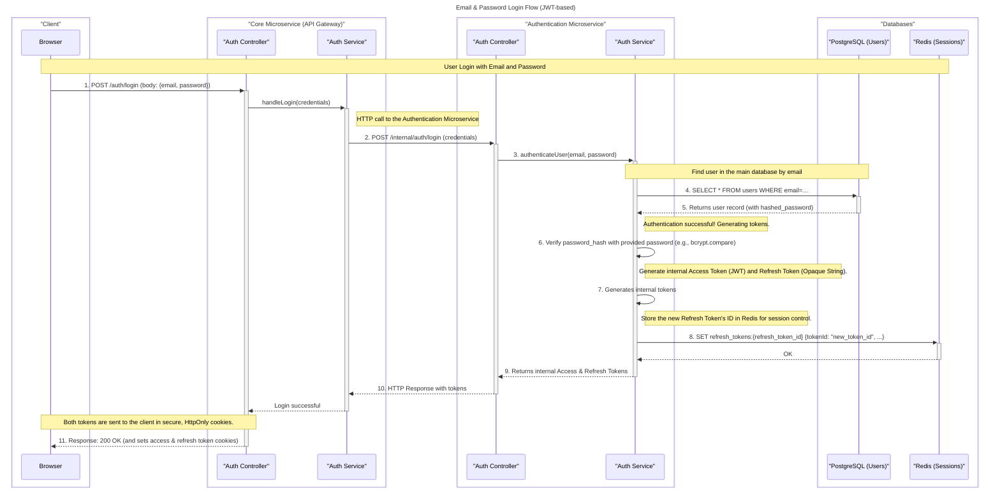
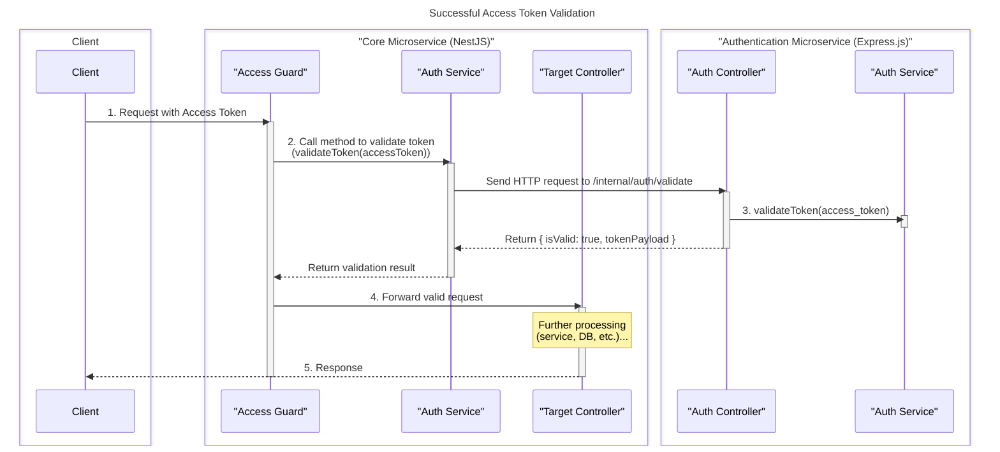
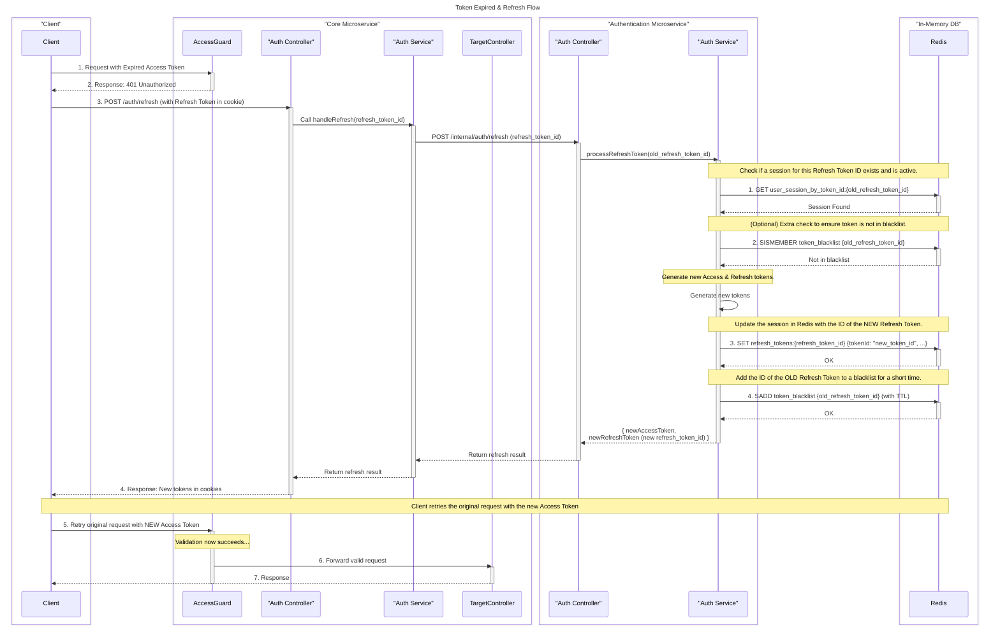
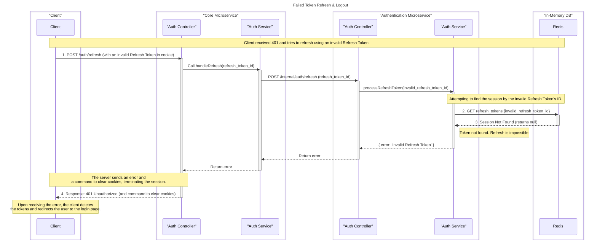
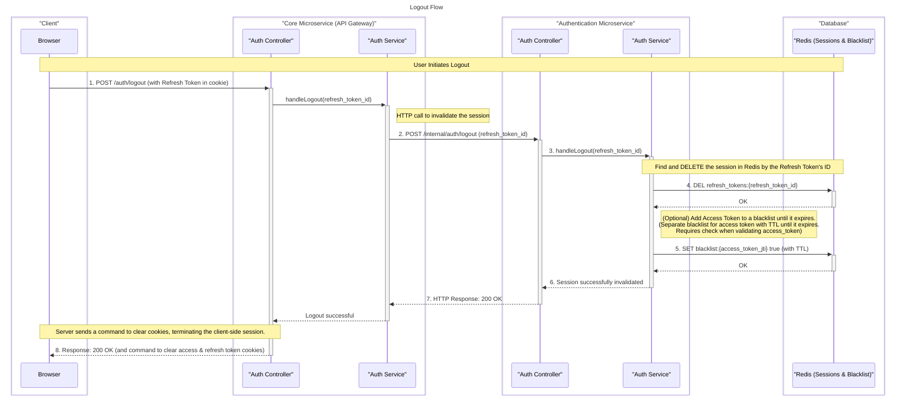
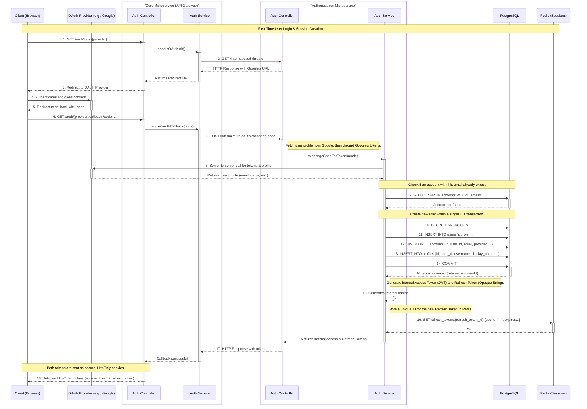
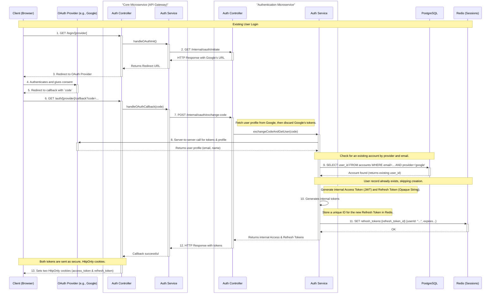
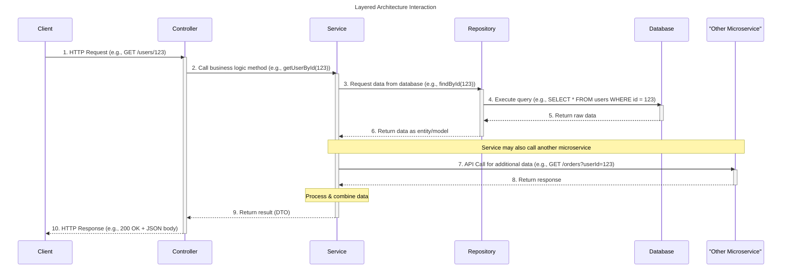

# Sequences diagrams

## Email and password authentication flows

### Sign Up (SEQUENCE)

### Sign In and Token Generation (SEQUENCE)

### Successful Access Token Validation (SEQUENCE)

### Token expired > Unsuccessful Access Token Validation > Successful Token Refresh (SEQUENCE)

### Token expired > Unsuccessful Access Token Validation > Unsuccessful Token Refresh (SEQUENCE)

### Logout (SEQUENCE)

## OAuth 2.0 authentication/authorization flows

### First-Time User Login via OAuth 2.0 (SEQUENCE)

### Existing User Login via OAuth 2.0 (SEQUENCE)

## Common flows

### Layered Architecture Interactions in MVC (SEQUENCE)

